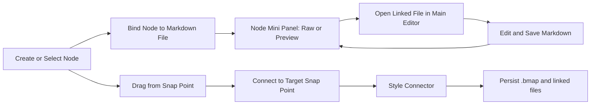

# Brainstorming Roadmap: Diagram Workspace Format

This document captures a major proposal for Stlio Marker: a visual flow-diagram workspace where each node can be linked to a markdown file for deep detail editing and preview.

## Purpose

Enable users to:
- Brainstorm large systems, stories, novels, and project plans visually.
- Keep concise node text for map readability.
- Attach rich detail to each node through linked markdown files.
- Jump quickly between map-level thinking and file-level writing.

## Core Product Direction

The diagram is not just drawing. It is a structured planning surface integrated with the existing project explorer, editor, preview, and collaboration stack.

## Primary Interaction Model

- User creates node shapes (rectangle or circle).
- User assigns node title and short text.
- User links each node to a markdown file.
- User previews linked markdown inside an in-node preview box.
- User opens linked file directly from node for full editing.
- User connects nodes using 4 snap points (top, right, bottom, left).
- User styles connectors (line type, curve, arrows, thickness, color, dashed).
- User can switch linked file display between raw source and rendered preview.

## Example User Stories

- As a novelist, I draft chapter structure with one node per scene and keep full scene notes in linked markdown files.
- As a software planner, I map architecture components and connect implementation notes to each node.
- As a researcher, I maintain idea graphs where each node expands into detailed references.

## New File Format Proposal

Working extension proposal:
- .bmap (Brainstorm Map)

Text format style:
- CSS-like custom syntax, similar spirit to .mtree customization.

### Example Syntax (draft)

.node {
  id: node-1
  name: Auth Flow
  text: Login and token exchange
  shape: rect
  pos: {x: 120, y: 80}
  file: notes/auth-flow.md
  styles: {
    background: #fffbe6
    border: 1px solid #e8b339
    color: #3b2f1a
    border-radius: 10px
    width: 260px
  }
}

.node {
  id: node-2
  name: Profile
  text: User profile lifecycle
  shape: circle
  pos: {x: 520, y: 220}
  file: notes/profile.md
  styles: {
    background: #e6f4ff
    border: 1px solid #1677ff
    color: #102a43
    width: 220px
    height: 220px
  }
}

.connect {
  from: node-1.side.1
  to: node-2.side.3
  styles: {
    mode: bezier
    curve: cubic-bezier(0.4, 0.0, 0.2, 1)
    arrow: end
    dashed: false
    thickness: 2
    color: #1677ff
  }
}

## Side Indexing Definition

For .side.N snap points:
- 0 = top
- 1 = right
- 2 = bottom
- 3 = left

## Linked File Preview Behavior

Each node has a mini panel showing linked file content with view mode toggle:
- Raw mode: text source.
- Preview mode: rendered markdown.

Initial scope:
- View-only mini panel inside node.
- Open linked file in source pane for full edits.

Future scope:
- Inline editing directly inside node preview panel.

## Diagram Flow (Concept)

## System Integration Requirements

- Explorer:
  - .bmap files appear as first-class files.
  - Optional derived child listing for referenced files (future).
- Source pane:
  - Raw .bmap text editing support.
- Preview pane:
  - Diagram rendering support for .bmap.
  - Node mini markdown preview support.
- Collaboration:
  - Sync .bmap text changes via existing patch-file operation model.
  - Sync linked markdown edits exactly as normal files.

## Data and Validation Rules (Draft)

- Every node requires unique id.
- file path should point to existing markdown file; missing files are allowed but marked unresolved.
- Connector endpoints must reference existing node ids and valid side indexes.
- Unknown style keys are ignored but preserved.

## MVP Boundary

Phase 1 MVP includes:
- .bmap parsing and serialization.
- Render rect/circle nodes with text.
- 4 snap points per node.
- Create and move connectors.
- Connector style controls: color, thickness, dashed, arrow-end, straight or bezier.
- Node link to markdown file.
- Node mini panel with raw/preview toggle (view-only).
- Open linked markdown in main editor from node action.

Out of MVP:
- Inline editing inside node preview panel.
- Advanced auto-layout.
- Real-time multi-cursor overlays in diagram canvas.

## Suggested Implementation Sequence

1. Define .bmap grammar and parser service.
2. Add .bmap extension recognition to project model and file services.
3. Add preview renderer for .bmap in preview pane.
4. Add diagram interaction layer (node drag, snap-point connect, style edits).
5. Add node-linked markdown mini panel.
6. Add collaboration conflict handling tests for .bmap concurrent edits.

## Architectural Fit Notes

- Keep parser and model logic in services/domain, not DOM code.
- Reuse existing markdown renderer for node mini previews.
- Keep diagram UI event-driven in main UI layer, aligned with current architecture rules.

## Relationship to Existing Pending Plan

The pending features in pending_plan.md should be integrated with this roadmap:
- Linked notes/backlinks can leverage node-to-file relationships.
- Session snapshots/time-travel should include .bmap and linked markdown states.
- Smart writing assistant can expose node-aware actions for linked files.

## Current Status

- Proposal state: Draft approved for roadmap discussion
- Implementation state: Not started
